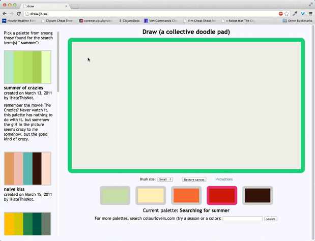

Draw
----

An experiment in using Canvas, Node and Socket.io to create a multi-user browser-based drawing app. You can see the other people drawing with you in real-time, even if they're on another continent. Check out the live site, hosted by Nodejitsu, at [draw.jit.su](http://draw.jit.su). Make sure to open it on two devices at the same time!

In its current form, it uses a search engine to grab color palettes from the API of a color-sharing website called colourlovers.com. 

In the future, it may or may not incorporate the following features:

* The ability to take snapshots of the canvas and save them to disk or upload them to social media sites or email them.
* The ability to grab from other palette collections.
* Other fun stuff. Ideas?

Upcoming near-term feature changes can be found in the Issues tab.

## Origin

This project came out of an assignment in the November 2011 Advanced Javascript class taught by Pedro Ha at NYU SCPS. Pedro had created a basic version of the app, and our assignment was to add the API search functionality and also to significantly refactor the code. His original concise and elegant version can be found in the folder "original-files." Our job as students (along with adding search functionality) was to organize it so that it was more scalable. I have also added a few minor enhancements and features (like the 'clear canvas' button). to the basic app, but most importantly, I have used Node.js to make it into a multi-user experience.

## License

Licenses for Pedro Ha's original version of this app and also for excanvas.js (by Google) can be found in the appropriate folders (see Origin above). All subsequent work is:

(MIT License)

Copyright (c) 2011 Richard Harrington

Permission is hereby granted, free of charge, to any person obtaining a copy of this software and associated documentation files (the "Software"), to deal in the Software without restriction, including without limitation the rights to use, copy, modify, merge, publish, distribute, sublicense, and/or sell copies of the Software, and to permit persons to whom the Software is furnished to do so, subject to the following conditions:

The above copyright notice and this permission notice shall be included in all copies or substantial portions of the Software.

THE SOFTWARE IS PROVIDED "AS IS", WITHOUT WARRANTY OF ANY KIND, EXPRESS OR IMPLIED, INCLUDING BUT NOT LIMITED TO THE WARRANTIES OF MERCHANTABILITY, FITNESS FOR A PARTICULAR PURPOSE AND NONINFRINGEMENT. IN NO EVENT SHALL THE AUTHORS OR COPYRIGHT HOLDERS BE LIABLE FOR ANY CLAIM, DAMAGES OR OTHER LIABILITY, WHETHER IN AN ACTION OF CONTRACT, TORT OR OTHERWISE, ARISING FROM, OUT OF OR IN CONNECTION WITH THE SOFTWARE OR THE USE OR OTHER DEALINGS IN THE SOFTWARE.
